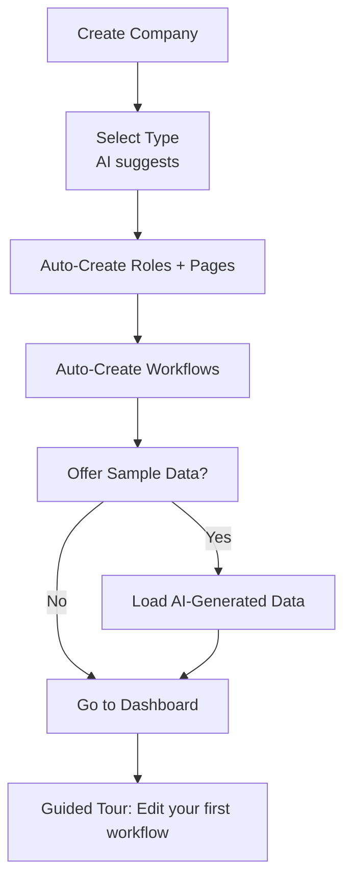

# Company Onboarding System - Business Requirements

**Document Type:** Business Requirements
**Version:** 1.0
**Last Updated:** 2025-01-XX
**Module:** Company Onboarding

---

## Overview

The Company Onboarding System provides an intelligent, personalized setup experience for new companies joining ATS Monkey. It applies CRM philosophy principles to company setup: building relationships from Day 1, providing intelligent automation, and delivering actionable configurations immediately.

---

## Design Philosophy

### Perfect Onboarding Principles

1. **Fast**: Minimal time to value
2. **Smart**: AI-powered suggestions and content
3. **Personalized**: Adapted to company type and needs
4. **Scalable**: Grows with the company

### CRM Philosophy in Onboarding

- **Relationship Building**: Candidates as customers mindset from the start
- **Intelligent Automation**: AI suggestions, not just empty forms
- **Actionable Data**: Ready-to-use configurations immediately
- **Seamless Experience**: Guided setup, not overwhelming options

---

## Initialization Levels

The onboarding process has three distinct levels that can be executed independently:

### Level 1: ONBOARDING
Basic platform setup including:
- User roles configuration
- Default pages creation
- Company profile setup

### Level 2: WORKFLOWS
Hiring process configuration:
- Workflow templates
- Stage definitions
- Automation rules

### Level 3: SAMPLE DATA
Optional evaluation mode:
- Sample candidates
- Example job positions
- Test users and data

---

## Functional Requirements

### FR-ON01: Company Type Selection

#### FR-ON01.1: Type Wizard
**Question**: "What best describes your company?"

| Type | Size | Characteristics |
|------|------|-----------------|
| **Startup / Small Business** | 1-50 employees | Fast hiring, multi-role users, agile |
| **Mid-Size Company** | 51-500 employees | Structured but flexible, growing |
| **Enterprise / Large Corporation** | 501+ employees | Compliance-heavy, complex approvals |
| **Recruitment Agency** | Any size | High-volume, client-focused |

#### FR-ON01.2: AI Suggestion
- **Trigger**: User skips selection or provides company name
- **Analysis**: Company name and description analyzed
- **Output**: Suggested company type with confidence
- **Override**: User can always select different type

#### FR-ON01.3: Default Selection
- **Default**: Mid-Size Company (if no selection or AI suggestion)

### FR-ON02: Role Configuration

#### FR-ON02.1: Base Roles
| Role | Responsibilities |
|------|------------------|
| **HR Manager** | Strategy, communication, offer stage |
| **Recruiter** | Sourcing, screening, engagement |
| **Tech Lead** | Technical assessments |
| **Hiring Manager** | Position-specific decisions |
| **Interviewer** | Conducts interviews |
| **Department Head** | High-level approvals |
| **CTO / C-Level** | Senior hires |

#### FR-ON02.2: Type-Specific Role Adjustments

| Type | Adjustments |
|------|-------------|
| **Startup/Small** | Combine HR Manager + Recruiter → HR Generalist; Add Founder |
| **Mid-Size** | Add Talent Acquisition Specialist |
| **Enterprise** | Add Diversity & Inclusion Officer, Legal Reviewer |
| **Agency** | Add Client Manager, Sourcer |

#### FR-ON02.3: First User Setup
- **Role**: First user automatically assigned as Owner/Admin
- **Invitation**: AI suggests roles when inviting team members

### FR-ON03: Default Pages

#### FR-ON03.1: Auto-Created Pages
| Page | Purpose | Endpoint |
|------|---------|----------|
| `public_company_description` | Public company overview | `/public/company/{id}/pages/...` |
| `job_position_description` | Benefits/culture in job posts | Same |
| `data_protection` | Privacy policy (GDPR/CCPA) | Same |
| `terms_of_use` | Platform legal terms | Same |
| `thank_you_application` | Post-application message | Same |

#### FR-ON03.2: Page Features
- **HTML Support**: Full HTML content
- **SEO Optimization**: Meta tags, structured data
- **Versioning**: Change history
- **Multi-language**: i18n support
- **Visual Editor**: Unlayer drag-and-drop editor

#### FR-ON03.3: Initialization Modes
| Mode | Status | Content |
|------|--------|---------|
| **Basic (no sample)** | DRAFT | Empty, ready to edit |
| **With Sample Data** | PUBLISHED | Pre-filled, customizable |

#### FR-ON03.4: Type-Specific Content

| Type | Tone | Content Focus |
|------|------|---------------|
| **Startup/Small** | Energetic, emojis | "Join our rocket ship!", growth, impact |
| **Mid-Size** | Professional, warm | Career paths, benefits, stability |
| **Enterprise** | Formal, compliant | EEO statements, legal disclaimers |
| **Agency** | Client-centric | Partnership focus, `{{client_name}}` placeholders |

#### FR-ON03.5: AI Content Generation
- **Input**: Company name, description, type
- **Output**: Draft content for all pages
- **Example**: "Based on 'Nexlify AI', here's your public description: 'We're building the future of...'"

### FR-ON04: Workflow Configuration

#### FR-ON04.1: Job Position Workflow
Auto-created "Job Positions Workflow" (Kanban):

| Stage | Type | Emoji |
|-------|------|-------|
| Draft | INITIAL | 📝 |
| Under Review | PROGRESS | 🔍 |
| Approved | PROGRESS | ✅ |
| Published | SUCCESS | 🌐 |
| Closed | ARCHIVED | 🔒 |
| Cancelled | FAIL | ❌ |

**Type Adjustments**:
| Type | Adjustments |
|------|-------------|
| **Startup** | Skip "Under Review" → 4 stages |
| **Mid-Size** | Add "Budget Approval" |
| **Enterprise** | Add "Compliance Review" |
| **Agency** | Add "Client Approval" |

#### FR-ON04.2: Candidate Application Workflows

**Phase 1: Sourcing** (Kanban)

| Stage | Type | Emoji | Notes |
|-------|------|-------|-------|
| Pending | INITIAL | 📋 | Entry point |
| Screening | PROGRESS | 🔍 | Initial review |
| Qualified | SUCCESS | ✅ | → Phase 2 |
| Not Suitable | FAIL | ❌ | ROW display |
| On Hold | PROGRESS | ⏸️ | ROW display |

**Phase 2: Evaluation** (Kanban)

| Stage | Type | Emoji | Notes |
|-------|------|-------|-------|
| HR Interview | INITIAL | 👥 | Entry from Phase 1 |
| Manager Interview | PROGRESS | 💼 | |
| Assessment Test | PROGRESS | 📝 | |
| Executive Interview | PROGRESS | 🎯 | |
| Selected | SUCCESS | ✅ | → Phase 3 |
| Rejected | FAIL | ❌ | ROW display |

**Phase 3: Offer & Pre-Onboarding** (List View)

| Stage | Type | Emoji |
|-------|------|-------|
| Offer Proposal | INITIAL | 💌 |
| Negotiation | PROGRESS | 🤝 |
| Document Submission | PROGRESS | 📄 |
| Document Verification | SUCCESS | ✅ |
| Lost | FAIL | ❌ |

#### FR-ON04.3: Type-Specific Workflow Adjustments

| Type | Sourcing | Evaluation | Offer |
|------|----------|------------|-------|
| **Startup** | 3 stages (fast) | 4 stages | 3 stages |
| **Mid-Size** | Standard | + Team Fit Interview | Standard |
| **Enterprise** | + Background Check | + Panel + Reference | + Contract Review |
| **Agency** | + Client Matching | + Client Interview | + Placement Fee |

### FR-ON05: Stage Configuration

#### FR-ON05.1: Stage Properties
| Property | Details |
|----------|---------|
| **Roles** | HR in Sourcing, Tech Lead in Assessment |
| **Emails** | Auto-send on stage entry |
| **Deadline** | 3 days (Sourcing), 7 days (Evaluation) |
| **Cost** | $100 (interview), $50 (test) |
| **Custom Fields** | Stage-specific data capture |

### FR-ON06: Custom Fields

#### FR-ON06.1: Recommended CRM-Driven Fields

| Category | Field | Type | Visibility | Stage |
|----------|-------|------|------------|-------|
| **Compensation** | Salary Range | Text/Number | Internal | All |
| | Current Salary | Number | Internal | Sourcing |
| | Salary Expectation | Number | Internal | Offer |
| **Availability** | Start Date | Date | Internal | Offer |
| | Notice Period | Text | Internal | Offer |
| **Evaluation** | Technical Score | Number (0-100) | Internal | Assessment |
| | Cultural Fit Score | Number (0-100) | Internal | Interviews |
| | Feedback | Textarea | Internal | All |
| **Offer** | Salary Offer | Number | Internal | Offer |
| | Benefits Package | Textarea | Internal | Offer |
| **Documents** | Document Status | Select | Internal | Verification |
| | Missing Docs | Text | Internal | Submission |
| **Source** | Recruitment Source | Select | Internal | Sourcing |
| | Recruiter Notes | Textarea | Internal | All |

#### FR-ON06.2: Type-Specific Fields

| Type | Extra Fields |
|------|--------------|
| **Startup** | Equity Offer (Number/%) |
| **Mid-Size** | Relocation Assistance (Yes/No + Details) |
| **Enterprise** | Diversity Metrics (Select: Underrepresented) - Mandatory in Sourcing |
| **Agency** | Client Fit Score, Bill Rate (Currency) |

#### FR-ON06.3: AI Field Suggestions
- **Prompt**: "For your startup, add 'Equity' field in Offer stage?"
- **Trigger**: Based on company type and industry
- **Action**: One-click addition of suggested fields

### FR-ON07: Sample Data

#### FR-ON07.1: Sample Data Quantities
| Item | Quantity | Details |
|------|----------|---------|
| Candidates | 50 | Varied stages, sources, scores |
| Job Positions | 10 | Draft → Published lifecycle |
| Users | 10 | With roles, tasks, comments |
| Applications | 10 | Linked to positions and users |

#### FR-ON07.2: Type-Specific Sample Data

| Type | Scale | Focus |
|------|-------|-------|
| **Startup** | 20 candidates, 5 positions | Agile, quick hires |
| **Mid-Size** | Standard | Diverse analytics |
| **Enterprise** | 100 candidates | Compliance scenarios |
| **Agency** | Standard + client tags | Multi-client pipelines |

#### FR-ON07.3: Sample Data Features
- **AI-Generated**: Realistic names, resumes, comments
- **Opt-In**: Checkbox "Load sample data?"
- **Cleanup**: `Reset Company Data` command available

---

## User Journey Flow

---

## Success Metrics

### Onboarding Performance

| Metric | Target |
|--------|--------|
| Time to first candidate | < 15 minutes |
| Time to first job posting | < 30 minutes |
| Onboarding completion rate | > 80% |
| User satisfaction | > 4.5/5 |

### Post-Onboarding Engagement

| Metric | Target |
|--------|--------|
| 7-day retention | > 70% |
| First workflow customization | > 50% within 7 days |
| First hire | < 30 days average |

---

## HR Expert Recommendations

### Onboarding Best Practices

#### 1. Progressive Disclosure
- **Recommendation**: Don't overwhelm users with all options at once
- **Implementation**: Guided setup with expandable advanced options
- **Benefit**: Faster time to value, reduced abandonment

#### 2. Contextual Help
- **Recommendation**: Provide help where needed, not separate documentation
- **Implementation**: Tooltips, inline guides, contextual suggestions
- **Benefit**: Self-service learning, reduced support tickets

#### 3. Quick Wins
- **Recommendation**: Enable early success to build confidence
- **Milestones**:
  - First user invited
  - First job posted
  - First candidate added
- **Celebration**: Visual acknowledgment of milestones

### Company Type Optimization

#### 1. Startup Needs
- **Speed**: Minimal friction, quick setup
- **Flexibility**: Easy to change, not rigid
- **Integration**: Connect with existing tools (Slack, etc.)

#### 2. Enterprise Needs
- **Compliance**: GDPR, EEO, SOC 2 considerations
- **Scalability**: Support for high volume
- **Control**: Granular permissions, audit trails

#### 3. Agency Needs
- **Multi-client**: Separate pipelines per client
- **Reporting**: Client-facing analytics
- **White-label**: Optional branding customization

### Content Recommendations

#### 1. Page Templates
- **Provide Examples**: Not just empty forms
- **Industry-Specific**: Different content for tech vs. retail
- **Legal Compliance**: Pre-written privacy policy templates

#### 2. Email Templates
- **Professional Tone**: Ready-to-use professional emails
- **Personalization**: Easy merge tag insertion
- **Testing**: Preview before activation

---

## Next Steps After Onboarding

### Immediate Actions (Day 1)
1. **Guided Tour**: "Edit your first workflow"
2. **First Job**: Wizard to create first position
3. **Invite Team**: Add team members with suggested roles

### Week 1 Goals
1. **Customize Pages**: Personalize career page content
2. **Configure Fields**: Add company-specific data fields
3. **Test Process**: Run test candidate through workflow

### Month 1 Goals
1. **First Hire**: Complete hiring process
2. **Team Adoption**: All team members active
3. **Process Refinement**: Adjust workflows based on experience

---

## Technical Notes

### Data Persistence
- All onboarding data saved immediately
- Progress tracked for interrupted sessions
- Rollback capability for mistakes

### Scalability
- System grows with company
- No re-onboarding needed for upgrades
- Additive configuration changes

### Multi-language
- Onboarding flow in user's language
- Content templates in multiple languages
- Auto-detection from browser settings

---

**Document Status**: Living document
**Owner**: Product Team
**Next Review**: Quarterly
